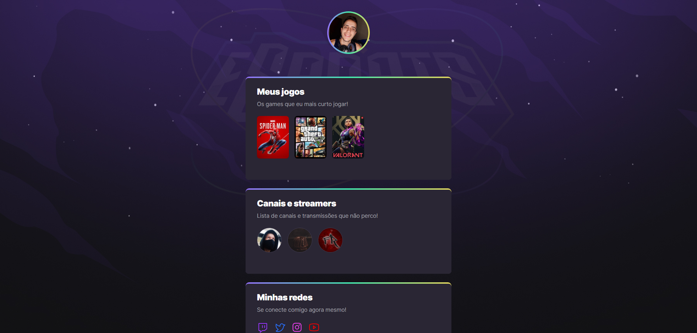

## **NLW eSports** 
# Evento da Rocketseat 💜

[🔔 Clique aqui para ver o projeto](https://gw-nogueira.github.io/nlw-esports/)

### 🚀 Projeto da trilha explorer!

Projeto desenvolvido para comunidade gamer:

- Possui sua foto pessoal do GitHub.
- Possui os jogos do usuário que ele mais gosta (Link das imagens da Twitch).
- Seus canais e streamers favoritos.
- E suas redes sociais para contato e interação.

## 🔧 Tecnologias:

- HTML5
- CSS3
- GitHub

## 📌 Meus maiores desafios nesse projeto:

- Publicar meu código local para o GitHub;
- Entender o versionamento do git;

###  💜 Meu contato

gaabrielwilliam25@gmail.com
